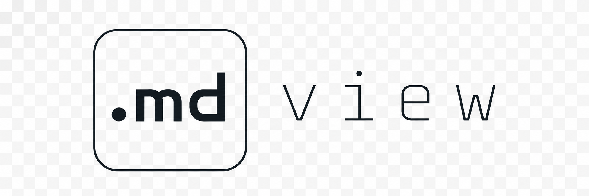

# md.view

<p align="center">
  
</p>

<p align="center">
  <strong>Leichtgewichtiger Markdown-Viewer — als macOS-App und als Browser-Webview.</strong><br/>
  Pixel-identische Darstellung über beide Targets via gemeinsamem Rendering-Core.
</p>

---

## Features

- **CommonMark + GFM** — Tabellen, Task-Lists, Strikethrough, Footnotes
- **Syntax-Highlighting** via [Shiki](https://shiki.style/) — VS-Code-Optik, präzise Grammatiken
- **GitHub-Style Rendering** — vertraut, lesbar, konservativ
- **TOC-Sidebar** mit Klick-Scroll und Scroll-Spy
- **Live-Reload** bei Datei-Änderungen (Mac-App)
- **Dark Mode** — folgt automatisch dem OS-Setting
- **Drag & Drop** — `.md`-Datei auf das App-Icon oder ins Fenster
- **Lokal & privat** — Web-Version lädt nichts hoch, alles bleibt im Browser
- **Native macOS-Integration** — `.md`-Dateien werden im Finder mit dem App-Icon angezeigt

## Architektur

Monorepo, npm workspaces. Vier Pakete, zwei Ziele:

| Pfad | Zweck |
|---|---|
| `packages/core` | Markdown → HTML Rendering (markdown-it + Shiki) |
| `packages/ui`   | Geteilte UI — HTML-Skelett, Sidebar, `mountViewer()` |
| `apps/mac`      | Electron-App, baut `md.view.app` |
| `apps/web`      | Statische Browser-App für `md.view` |

Der gemeinsame `core` + `ui` garantiert, dass Mac-App und Browser-Build **identisch** rendern — kein Drift zwischen Targets.

## Quickstart

```bash
# 1) Repo klonen
git clone https://github.com/peab-dev/md.view.git
cd md.view

# 2) Dependencies installieren (npm workspaces)
npm install

# 3a) Web-Viewer im Dev-Modus starten
npm run dev:web
#     → http://localhost:5173

# 3b) Mac-App im Dev-Modus starten
npm run dev:mac
#     → Electron-Fenster mit Hot-Reload
```

### Produktions-Builds

```bash
# Web — statische Dateien in apps/web/dist/
npm run build:web

# Mac — signierte .dmg + .zip in apps/mac/release/
npm run build:mac

# Beides
npm run build:all
```

Die fertige `md.view.app` aus `apps/mac/release/` kann nach `/Applications` gezogen werden. Danach öffnet ein Doppelklick auf jede `.md`-Datei im Finder den Viewer; das Doc-Icon wird ebenfalls gebrandet.

## Verwendung

### Web

```bash
npm run dev:web
```

Drop a `.md` file onto the page, or use the file picker. Alles passiert lokal — kein Upload, keine Telemetrie.

### macOS

- `⌘O` — Datei öffnen
- Drag & Drop ins Fenster oder auf das Dock-Icon
- Auto-Reload bei Änderungen der geöffneten Datei
- `⌘W` schließt das Fenster, `⌘Q` beendet die App

## Tech-Stack

- **TypeScript** — strikt, monorepo-weit
- **markdown-it** — robuster CommonMark-Parser mit GFM-Plugins
- **Shiki** — TextMate-Grammatiken, WASM-basiert (CSP-konform)
- **Vite** — Dev-Server & Bundler
- **Electron 32** — macOS-Wrapper
- **electron-builder** — Code-Signing, DMG, `.icns`, File-Associations

## Projekt-Struktur

```
md.view/
├── apps/
│   ├── mac/          # Electron-App
│   │   ├── src/main/         # Main-Prozess (window, file watcher, IPC)
│   │   ├── src/preload/      # Kontextisolierte Bridge
│   │   ├── src/renderer/     # Renderer (HTML + UI-Mount)
│   │   └── electron-builder.yml
│   └── web/          # Statischer Browser-Build
├── packages/
│   ├── core/         # renderMarkdown(src) → HTML
│   └── ui/           # mountViewer(root), Sidebar, Styles
├── resources/        # icon.icns, icon-doc.icns, logo PNGs
└── examples/         # Beispiel-Markdown-Dateien
```

## Entwicklung

```bash
# Einzelpakete bauen
npm run build:core
npm run build:ui

# TypeScript-Watch im einzelnen Workspace
npm run dev -w packages/core
```

Bei Änderungen am `core` oder `ui` Paket muss in den meisten Fällen einmal gebaut werden, damit die Apps die neuen Outputs sehen — Vite löst die Workspace-Symlinks gegen die `dist/` der Pakete auf.

## Lizenz

MIT © Peter

---

<p align="center">
  <sub>Made with <code>.md</code> in mind.</sub>
</p>
